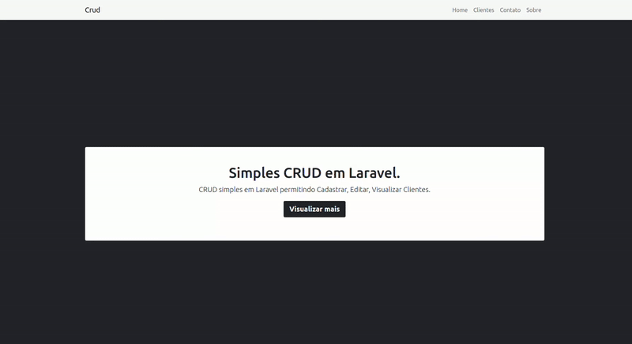

# Formação Laravel Full-Stack

    

### Rodando o servidor
sudo docker compose up --build

### Criando projeto Laravel
composer create-project laravel/laravel .

### Agradecimentos
Projeto e aulas baseadas na formação [Desenvolvedor Laravel Full-Stack](https://www.treinaweb.com.br/), disponibilizada pela [TreinaWeb](https://www.treinaweb.com.br/). Meus agradecimentos a [TreinaWeb](https://www.treinaweb.com.br/) por este conteúdo sensacional.