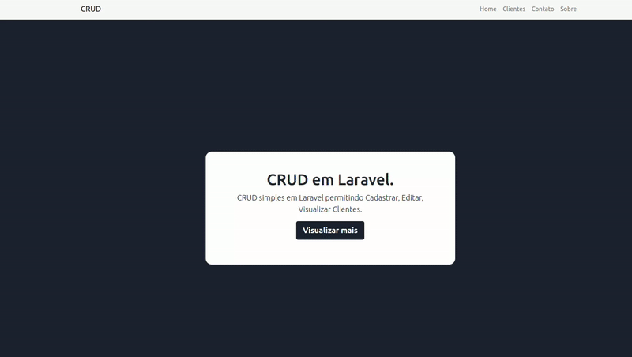

# Development CRUD using the Laravel Framework

    

### Rodando o servidor
sudo docker compose up --build

### Criando projeto Laravel
composer create-project laravel/laravel .

### Rodando o projeto existente
composer update && php artisan key:generate

### Gere as tabelas
php artisan migrate

### Ajustando erros de permissão
chmod -R 777 /var/www/php/